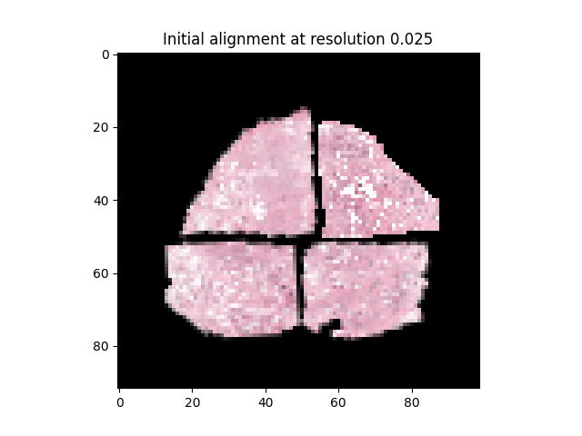

  

<h1 align="center">Pythostitcher</h2>

   
   

    
## General
Pythostitcher is a Python implementation of the [AutoStitcher](https://www.nature.com/articles/srep29906) software which stitches prostate histopathology images into an artifical whole mount image. Although the general stitching mechanism of Pythostitcher is similar to AutoStitcher, PythoStitcher offers several new features, most notably the ability to reconstruct a full resolution (0.25 µm) whole-mount. Furthermore, PythoStitcher is implemented in Python and significantly faster compared to the [original implementation in Matlab](https://engineering.case.edu/centers/ccipd/content/software). In addition, Pythostitcher offers several new advanced features such as 1) automatically finding the optimal fragment configuration, 2) providing a smooth overlap between overlapping parts with gradient alpha blending and 3) providing support for a varying number of tissue fragments. 

## Algorithm input
The input for Pythostitcher consists of either two or four high resolution histopathology images and the corresponding tissue masks. These must both be pyramidal files and consist of incrementally downsampled resolutions (preferable .mrxs or .tif format).  These tissue masks can be generated by your tissue segmentation algorithm of choice, in the provided sample data we make use of the algorithm from [Bándi et al](https://pubmed.ncbi.nlm.nih.gov/31871843/). Although not required, the user may specify the desired location of the tissue fragments in the final reconstruction. In the case of a prostatectomy cross-section which consists of two fragments, these locations would usually be left and right. Currently, supported locations are ['right', 'left', 'top', 'bottom']. If these locations are not specified, PythoStitcher will automatically figure out the most suitable way to reconstruct the whole-mount. This will be performed by using [JigsawNet](https://github.com/Lecanyu/JigsawNet), a CNN trained to identify adjacent fragments in jigsaw puzzles.

## Algorithm details
After preprocessing the input images, Pythostitcher will perform an automated stitch edge detection and compute a rough initial alignment on heavily downsampled versions of the input images. This initial alignment is then iteratively refined using images with an increasingly finer resolution. This refinement is performed by a genetic algorithm, which aims to minimize the average distance between the stitch edges of adjacent fragments. One of the strengths of Pythostitcher is that the optimal alignment between fragments can be scaled linearly for finer resolutions. Hence, when a satisfactory alignment is achieved on a lower resolution, this alignment can be scaled up linearly to compute the full resolution stitched result. This greatly improves computational overhead, since the full resolution images can be up to ~100k pixels in height/width, making any direct image processing infeasible on a regular clinical workstation.

## Usage instructions
It is highly recommended to run PythoStitcher as a Docker container, since PythoStitcher uses [PyVips](https://github.com/libvips/pyvips) and the backend from [ASAP](https://github.com/computationalpathologygroup/ASAP), which both can not be readily pip installed. The Docker container comes prepackaged with these libraries, as well as with model weights of the involved CNNs, and should run out-of-the-box. You can download the container [here](https://filesender.surf.nl/?s=download&token=708ac00a-d2ce-4576-acf9-366c940de051).

You can try out Pythostitcher yourself on your data or on the sample data available from . The sample data includes two prostatectomy cases, one case with four fragments and one case with two fragments. After downloading the data, save it somewhere on your disk and provide the path to this directory as an argument to the PythoStitcher container. If you want to enforce the location of each fragment in the final reconstruction, be sure to include a force_config.txt file in each patient directory. See the example_force_config.txt file on how to format this. 
	
	pythostitcher/ 
	├── src
	├── sample_data
	│   └── P000001
	|      └── raw images
	|         ├── image1
	|         └── image2
	|      └── raw masks
	|         ├── image1
	|         └── image2
	│      └── force_config.txt [OPTIONAL]
	│   └── P000002
	etc.

            
After preparing the input data in the aforementioned format, you can run PythoStitcher through the command line using:

    python3 main.py --data_dir "/path/to/sample_data/" --save_dir "/your/custom/path/" --patient "patient_idx"
where *data_dir* refers to the directory with your input data, *save_dir* refers to the location to save the result and *patient* refers to one of the cases in the data directory. Example line to obtain the result for patient P000001 from the prostate dataset:

    python3 main.py --data_dir "~/pythostitcher/sample_data" --save_dir "~/pythostitcher/results" --patient "prostate_P000001"
 

## Licensing
The source code of Pythostitcher is licensed under the [GNU Lesser General Public License (LGPL)](https://www.gnu.org/licenses/lgpl-3.0.nl.html). The provided sample data is licensed under the [CC Attribution 4.0 International license](https://creativecommons.org/licenses/by/4.0/legalcode). Please take these licenses into account when using Pythostitcher.

